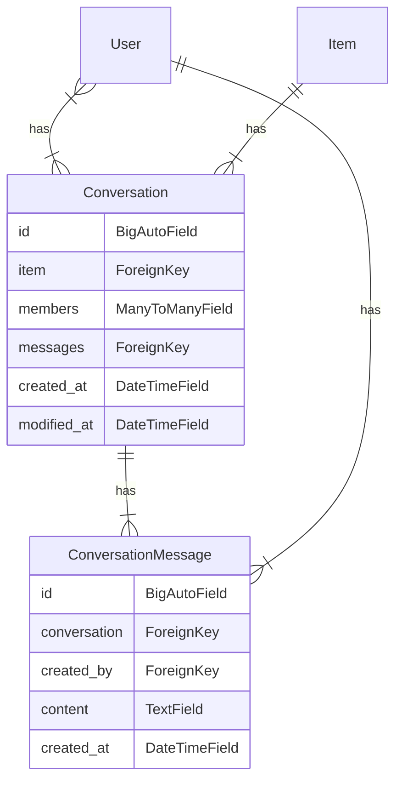

```mermaid
erDiagram
    Conversation {
        id BigAutoField
        item ForeignKey
        members ManyToManyField
        messages ForeignKey
        created_at DateTimeField
        modified_at DateTimeField
    }
    ConversationMessage {
        id BigAutoField
        conversation ForeignKey
        created_by ForeignKey
        content TextField
        created_at DateTimeField
    }
    User }|--|{ Conversation : has
    Item ||--|{ Conversation : has
    Conversation ||--|{ ConversationMessage : has
    User ||--|{ ConversationMessage : has
```