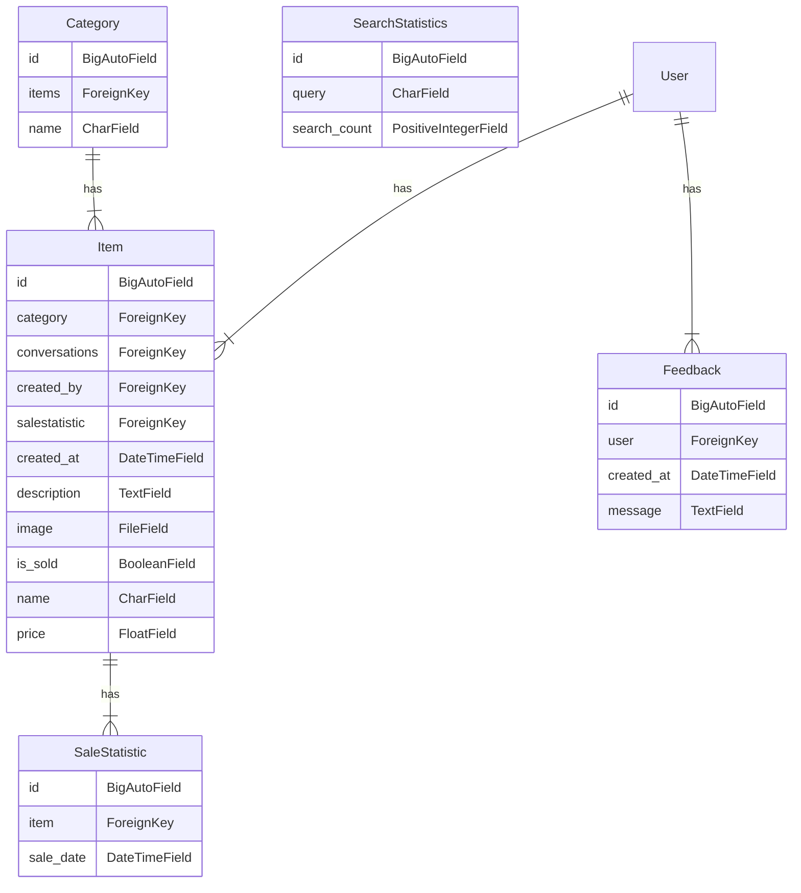

```mermaid
erDiagram
    Category {
        id BigAutoField
        items ForeignKey
        name CharField
    }
    Item {
        id BigAutoField
        category ForeignKey
        conversations ForeignKey
        created_by ForeignKey
        salestatistic ForeignKey
        created_at DateTimeField
        description TextField
        image FileField
        is_sold BooleanField
        name CharField
        price FloatField
    }
    SearchStatistics {
        id BigAutoField
        query CharField
        search_count PositiveIntegerField
    }
    Feedback {
        id BigAutoField
        user ForeignKey
        created_at DateTimeField
        message TextField
    }
    SaleStatistic {
        id BigAutoField
        item ForeignKey
        sale_date DateTimeField
    }
    Category ||--|{ Item : has
    User ||--|{ Item : has
    User ||--|{ Feedback : has
    Item ||--|{ SaleStatistic : has
```